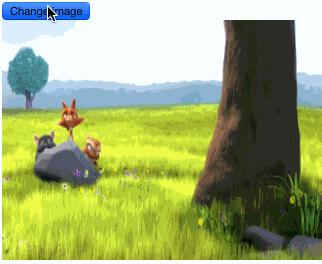

# react-imageblurloader

  


Show a nice blurry preview while your images are loading.



## Install

`npm install -S react-imageblurloader`

## Usage

```html
<ImageBlurLoader
  src={ image.url }
  preview='data:image/jpeg;base64,iVBORw0KGgoAAAANSUhEU...'
  width={ 1024 }
  height={ 768 }
/>
```

## Demo

`npm start` then visit http://127.0.0.1:3000

## Generating previews

Using ImageMagick : `convert input.jpg -resize 20x20 -quality 70 preview.jpg`

Then get the base64 : `base64 preview.jpg`
